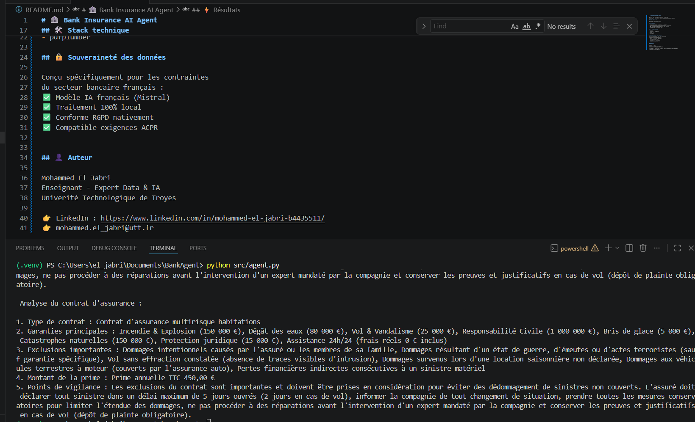

# 🏦 Bank Insurance AI Agent

Agent IA 100% local pour l'analyse automatique 
de contrats d'assurance — secteur banque & assurance français.

## 🎯 Ce que ça fait

## ⚡ Résultats

- Analyse un contrat en moins de 2 minutes
- Extraction automatique des garanties et exclusions
- 100% local — zéro donnée envoyée dans le cloud
- Conforme RGPD & exigences ACPR

## 🛠️ Stack technique

- Mistral
- LangChain + LangGraph
- Python 3.14
- pdfplumber

## 🔒 Souveraineté des données

Conçu spécifiquement pour les contraintes 
du secteur bancaire français :
✅ Modèle IA français (Mistral)
✅ Traitement 100% local
✅ Conforme RGPD nativement
✅ Compatible exigences ACPR

## 👤 Auteur

Mohammed El Jabri
Enseignant - Expert Data & IA
Univerité Technologique de Troyes

👉 LinkedIn : https://www.linkedin.com/in/mohammed-el-jabri-b4435511/
👉 mohammed.el_jabri@utt.fr